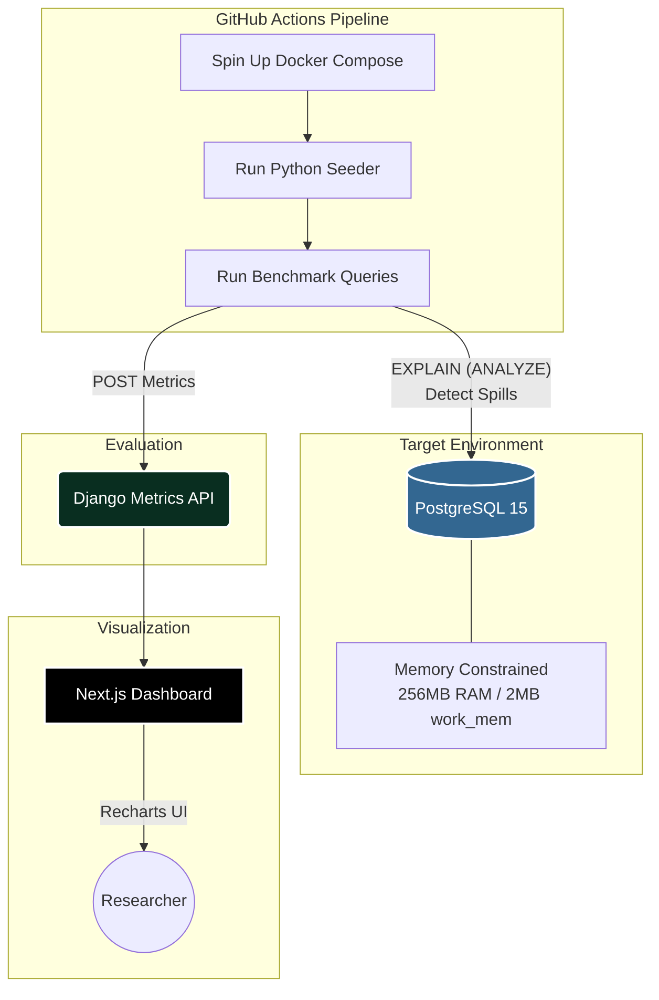
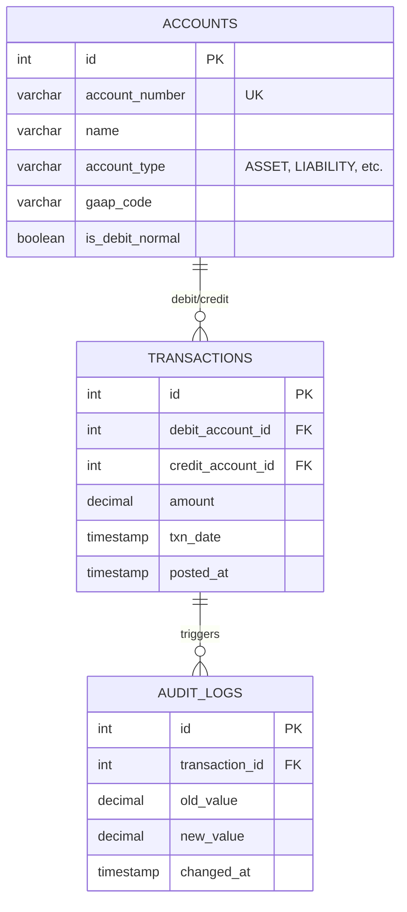
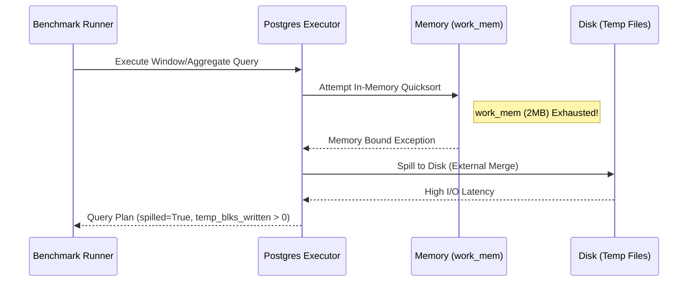

# pg-memory-spill-benchmarker 


An automated, CI/CD-driven database benchmarking testbed specifically designed to artificially starve a PostgreSQL database of memory, forcing it to "spill to disk" during heavy analytical queries. 

> **Project Goal**: This project serves as a direct technical portfolio submission for a graduate Research Assistantship under **Dr. Oliver Kennedy** in the **ODIn Lab at SUNY Buffalo**. It bridges my industry experience as a Systems/DevOps Engineer with the lab's 2026 research focus: *"Flow-centric Query Evaluation Pipelines"*.

---

## 🔬 The Research Connection

The ODIn lab focuses on data management systems, specifically decoupling database compute operations from memory management to prevent bottlenecks and disk I/O thrashing. 

This testbed provides a highly-controlled, automated environment that intentionally creates the very conditions discussed in the research paper:
1. **Memory Starvation**: We heavily constrain `work_mem` (2MB) and container memory (256MB).
2. **Heavy Analytical Workloads**: We simulate massive aggregations, multi-key sorts, and window functions over millions of rows of US-GAAP financial data.
3. **Observation & Metrics**: We capture exact moments of pipeline degradation (e.g., `external merge Disk`) using `EXPLAIN (ANALYZE, BUFFERS)` and `pg_stat_statements`, pushing these metrics to a monitoring API.

---

## 🏗️ Architecture

The project consists of 5 tightly integrated components adhering to strict Systems Engineering principles (no generic boilerplate, typed code, high performance).



### 1. Target Database (Docker)
A PostgreSQL 15 instance optimized for failure. It operates with restricted resources to simulate a heavily loaded node:
- **Memory**: 256MB Container Limit.
- **`work_mem`**: 2MB (Forces quick sorts to spill to disk).
- **`pg_stat_statements`**: Enabled to track cumulative block reads/writes.

### 2. Python Seeder & Runner
A pure-SQL approach to data generation. Instead of slow ORM loops, it uses `generate_series` to instantiate millions of US-GAAP standard transactions and audit logs in seconds.
- **Seeder**: Generates 50,000 Accounts, 2,000,000 Transactions, and 2,000,000 Audit Logs.
- **Runner**: Executes targeted analytical queries, parses query plans, and detects exact hash/sort boundaries.

### 3. Metrics API (Django)
A lightweight Django REST Framework (DRF) sink utilizing SQLite. Acts as a webhook receiver to reliably store benchmark results containing execution time, spill status, sort space utilized, and temporary read/write blocks.

### 4. Frontend Dashboard (Next.js)
A Next.js frontend built with TailwindCSS and Recharts to visualize query execution latency spikes, disk spill ratios, and memory starvation over time in a polished, real-time UI.

### 5. Automation (GitHub Actions)
Fully automated continuous benchmarking. Commits trigger a workflow that provisions the database, seeds it, runs the runner script, and stores the analytics.

---

## 🗄️ Database Schema & ERD

The dataset simulates a high-throughput strict accounting ERP system (similar to "Kishancare"), enforcing double-entry rules and GAAP constraints.



---

## ⚙️ How it works: Flow-Centric Query Pipeline

When the benchmark runs, it issues complex queries that require grouping and sorting massive datasets. The architecture forces PostgreSQL's query evaluation pipeline into a bottleneck:



---

## 🚀 Running Locally (No AWS Required)

Currently, the testbed operates entirely locally using Docker. 

### Prerequisites
- Docker & Docker Compose
- Python 3.11+
- Node.js 18+

### Step-by-Step Setup

**1. Start the Starved PostgreSQL Database**
```bash
docker-compose -f infra/docker-compose.yml up -d
```
*Note: This will limit the container to 256MB RAM. Ensure Docker Desktop has resource limiting enabled.*

**2. Start the Metrics API (Django)**
```bash
cd api
python -m venv venv
source venv/bin/activate  # On Windows: venv\Scripts\activate
pip install -r requirements.txt
python manage.py migrate
python manage.py runserver 8000
```

**3. Run the Benchmarker (Seeder & Runner)**
In a new terminal:
```bash
cd bench
python -m venv venv
source venv/bin/activate  # On Windows: venv\Scripts\activate
pip install -r requirements.txt
python seeder.py   # Generates 4M+ rows rapidly
python runner.py   # Executes queries and POSTs metrics
```

**4. View the Dashboard**
In another terminal:
```bash
cd dashboard
npm install
npm run dev
```
Navigate to `http://localhost:3000` to view the performance degradation metrics.

---

## 🤖 AI & Tooling

This project was architected and implemented using state-of-the-art AI tooling:
- **IDE**: Google Antigravity IDE
- **Planning & Architecture**: Anthropic Claude Opus 4.6 (Thinking Mode)
- **Implementation & Engineering**: Google Gemini 3.1 Pro (High)

These models strictly adhered to systems engineering practices, avoiding generic boilerplate and focusing on high-performance constraints suited for an academic research context.

---

*Designed and implemented by Sandesh Dahal as a portfolio piece for the SUNY Buffalo Computer Science and Engineering Department.*
